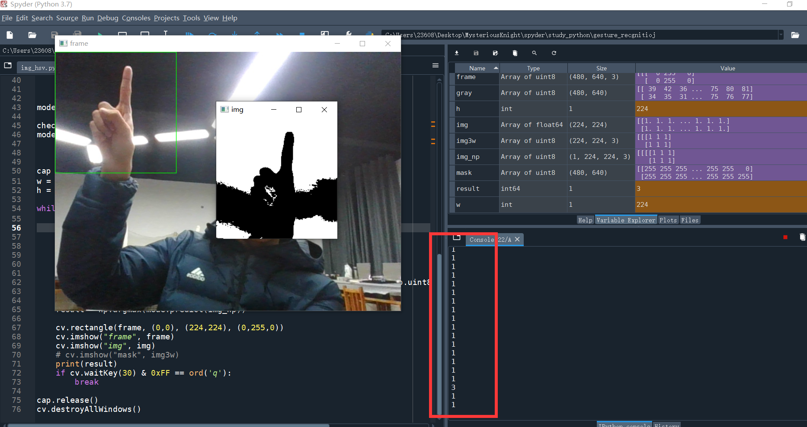
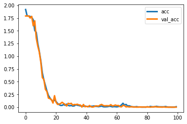

# Gesture_cognition(手势识别)

# 一、项目信息

​		该项目基于**Tensorflow2.3**开发，自建六种手势数据集，内置图像预处理，图像增广，网络模型，识别等程序。可帮助新手掌握如何使用自制数据集进行模型训练，分类，调用训练好的模型进行目标检测。

​		因为计算机GPU资源有限，仅仅训练了2400张图片，采用的灰度二值化图像处理方式。在保存数据集的时候，我先将增广之后的图片进行保存，再读取图片保存为NumPy，这样导致了本来是两个维度的二值化图依旧有三个维度，可对代码进行修改，减少图像维度，减少计算量。

​		所有的数据集均为自制数据集，仅供学习使用，禁止用于商业用途。

### 		训练效果:



# 二、软件环境

| 软件库及环境   | 版本信息  |
| -------------- | --------- |
| Anaconda3      | Python3.7 |
| Cuda           | 10.2      |
| Cudnn          | 7.6.5     |
| 显卡           | GTX1650   |
| OpenCV-python  | 4.5.3.56  |
| Tensorflow-gpu | 2.3.0     |
| Numpy          | 1.18.5    |
| Matplotlib     | 3.4.2     |


​		开发所用的IDE是Anaconda自带的Spyder,在开发项目的时候,可使用anaconda创建虚拟环境,创建Python3.7的环境,安装Tensorflow2.x以上的版本,Tensorflow2.x只支持Python3.7以上的版本.安装cuda和cudnn需要根据自己的电脑配置来进行安装,安装过程过于繁琐,读者加油!

# 三、项目结构

### （1）文件目录

```python
+---img_augment # 增广数据集
+---img_binary  # 灰度二值化数据集
+---img_gray    # 灰度数据集
+---img_hsv     # HSV数据集
+---img_main    # 原始数据集
+---weight	    # 保存的模型文件
+---alexNet.py  # 训练模型
+---demo_cv.py  # 调用模型进行识别检测
+---img_aug.py  # 数据增广
+---img_augment_rename.py  # 增广数据集命名重写
+---img_gray.py # 转换为灰度图并保存在img_gray
+---img_hsv.py  # 转换为HSV并保存在img_hsv
+---img_main_rename.py  #原始数据集命名重写
+---train_test.py  # 数据集转换为numpy格式并保存
\---acc.png  # 模型训练acc图
```


### （2）网络模型结构

```Python
Model: "functional_9" # alexnet网络结构
_________________________________________________________________
Layer (type)                 Output Shape              Param #   
=================================================================
input_5 (InputLayer)         [(None, 224, 224, 3)]     0         
_________________________________________________________________
zero_padding2d_4 (ZeroPaddin (None, 227, 227, 3)       0         
_________________________________________________________________
conv2d_20 (Conv2D)           (None, 55, 55, 48)        17472     
_________________________________________________________________
max_pooling2d_12 (MaxPooling (None, 27, 27, 48)        0         
_________________________________________________________________
conv2d_21 (Conv2D)           (None, 27, 27, 128)       153728    
_________________________________________________________________
max_pooling2d_13 (MaxPooling (None, 13, 13, 128)       0         
_________________________________________________________________
conv2d_22 (Conv2D)           (None, 13, 13, 192)       221376    
_________________________________________________________________
conv2d_23 (Conv2D)           (None, 13, 13, 192)       331968    
_________________________________________________________________
conv2d_24 (Conv2D)           (None, 13, 13, 128)       221312    
_________________________________________________________________
max_pooling2d_14 (MaxPooling (None, 6, 6, 128)         0         
_________________________________________________________________
flatten_4 (Flatten)          (None, 4608)              0         
_________________________________________________________________
dropout_8 (Dropout)          (None, 4608)              0         
_________________________________________________________________
dense_12 (Dense)             (None, 2048)              9439232   
_________________________________________________________________
dropout_9 (Dropout)          (None, 2048)              0         
_________________________________________________________________
dense_13 (Dense)             (None, 1024)              2098176   
_________________________________________________________________
dense_14 (Dense)             (None, 6)                 6150      
_________________________________________________________________
softmax_4 (Softmax)          (None, 6)                 0         
=================================================================
Total params: 12,489,414
Trainable params: 12,489,414
Non-trainable params: 0
_________________________________________________________________
```

### 		

### 		（3）训练精度与预测精度

### 													

# 四、程序说明

​		在项目开始之前，请先建立好

​		img_gray、img_binary、img_hsv、img_augment、weight文件夹,按照img_main的格式将目录结构建好，包含0，1，2，3，4，5五个子文件夹。

​		如果需要重新生成新的图片,记得把文件夹中的图片都删除,不要删除原始数据集即可。

​		先将原始数据集增广,然后进行灰度二值化或者hsv处理,最后生成特征数组和标签数组,运行神经网络进行模型训练,调用模型进行结果预测。

        下载模型文件，放入weight文件夹中。
​		链接：https://pan.baidu.com/s/15mgnubGLkv3imaJe1s38Og 
        提取码：gest

### 		（1）img_main_rename.py 

​		该程序仅仅只是修改了原始数据集的文件名，方便查看，阅读方便。读者可自己拍摄数据集，记得要进行归一化处理，可参考demo_cv文件中对图像的归一化处理，本项目未给出归一化处理程序。

### 		（2）img_aug.py

​		增广数据集,将增广的数据集保存在img_augment文件夹中。

### 		（3）img_augment_rename.py

​		该程序仅仅只是修改了增广数据集的文件名。

### 		（4）img_gray.py

​		原始数据集准备好之后，可运行该函，转换为灰度图并保存在img_gray文件夹中（或者修改文件路径，保存二值图），我在程序里面是直接将增广数据集转为灰度图之后，二值化之后直接保存在img_binary文件夹里面，请注意。

### 		（5）img_hsv.py

​		转换为灰度图并保存在img_hsv文件夹中。

### 		（6）train_test.py

​		将img_binary数据集转换为NumPy格式并保存。

### 		（7）alexNet.py

​		使用Alex net神经网络训练模型，并保存模型在weight中。

### 		（8）demo_cv.py

​		调用模型，调用摄像头将图像信息传入模型中，得到预测结果。

# 五、模型评估

​		该模型因为训练数据量少,过拟合严重,在复杂环境下的识别精度低.可采用HSV的方式对图像进行二值化处理，本项目只保存了hsv图，因为GPU资源的原因,并没有训练hsv二值化之后的图像进行模型对比，读者自己尝试，或更改网络结构，增大数据集的数量，提高模型在复杂环境下的精确度。不过对于新手来说学习足矣。

​		
